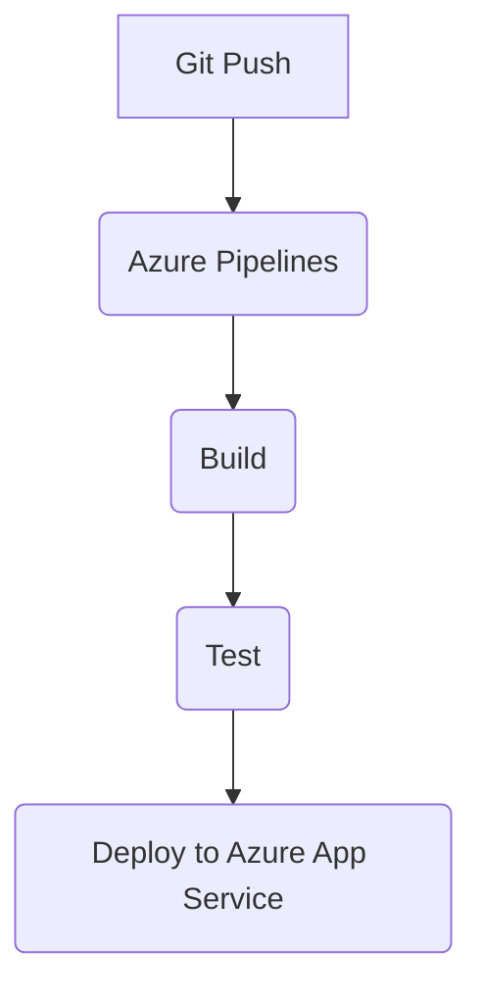

# Complete Azure DevOps Tutorial for Beginners (Updated for 2025)

Welcome to this comprehensive, step-by-step tutorial on Azure DevOps! Azure DevOps is a cloud-based platform from Microsoft that helps teams plan, develop, test, and deploy software applications efficiently. It's designed to support DevOps practices, which emphasize collaboration between development (Dev) and operations (Ops) teams for faster, more reliable software delivery. Whether you're a beginner developer, project manager, or IT professional, this guide will walk you through everything from setup to advanced features.

This tutorial assumes basic knowledge of software development concepts but no prior Azure DevOps experience. We'll cover the core services: **Azure Boards**, **Repos**, **Pipelines**, **Test Plans**, **Artifacts**, and **Extensions**. By the end, you'll have hands-on experience building a simple CI/CD pipeline.

**Note:** All instructions are in English (as "US language" typically refers to American English). Screenshots or visuals aren't included here, but I'll reference where to find them in the official docs.

## What is Azure DevOps?

Azure DevOps is a SaaS (Software as a Service) platform that integrates tools for the entire software development lifecycle (SDLC). It evolved from Visual Studio Team Services (VSTS) in 2018 and now supports agile planning, version control, automated builds, testing, and deployments. Key benefits include:
- **Collaboration:** Real-time tracking and shared visibility.
- **Automation:** CI/CD pipelines reduce manual errors.
- **Scalability:** Works with any language, platform, or cloud (e.g., Azure, AWS, GitHub).
- **Integration:** Connects with tools like GitHub, Slack, or Jira.

**Pricing (as of 2025):** Free for up to 5 users with basic features; paid plans start at $6/user/month for advanced usage. Check [Azure DevOps Pricing](https://azure.microsoft.com/en-us/pricing/details/devops/) for details.

**Prerequisites:**
- A Microsoft account (free at [outlook.com](https://outlook.com)).
- Basic command-line knowledge (e.g., Git).
- Optional: Visual Studio Code (free IDE) for coding.

## Step 1: Setting Up Your Azure DevOps Account and Organization

1. **Sign Up:**
   - Go to [dev.azure.com](https://dev.azure.com).
   - Click **Start free** and sign in with your Microsoft account. If you're new, select "Create a Microsoft account" (no credit card needed).
   - Accept the terms and create your organization (e.g., "MyDevOpsOrg"). This is your top-level workspace.

2. **Create Your First Project:**
   - In the organization dashboard, click **New Project**.
   - Enter a name (e.g., "MyFirstApp"), description, and visibility (Private for teams; Public for open-source).
   - Choose **Git** for version control (recommended over TFVC for beginners).
   - Click **Create**. You'll land in the project overview.

**Tip:** Organizations can host multiple projects. For tutorials, start with one.

Your project dashboard shows all services. Let's explore them one by one.

## Step 2: Azure Boards – Planning and Tracking Work

Azure Boards is for agile project management: backlogs, Kanban boards, sprints, and reporting.

### Key Features:
- **Work Items:** Track tasks, bugs, features, or epics.
- **Backlogs:** Prioritize work.
- **Boards:** Visualize progress with Kanban or Scrum views.
- **Dashboards:** Custom widgets for metrics.

### Hands-On: Create a Backlog
1. In your project, select **Boards > Backlogs**.
2. Click **+ New Work Item** > **User Story** (e.g., Title: "As a user, I want to log in securely").
3. Add details: Description, Acceptance Criteria, Tags.
4. Drag items to prioritize in the backlog.
5. Switch to **Boards > Kanban** to see a visual flow (To Do > Doing > Done).

**Pro Tip:** Link work items to code commits for traceability (e.g., use #WorkItemID in commit messages).

For more: [Azure Boards Documentation](https://learn.microsoft.com/en-us/azure/devops/boards/?view=azure-devops).

## Step 3: Azure Repos – Version Control with Git

Azure Repos provides unlimited private Git repositories for code storage and collaboration.

### Key Features:
- **Git Repos:** Branching, pull requests (PRs), and merge policies.
- **TFVC:** Centralized version control (less common now).
- **Branch Policies:** Require reviews before merging.

### Hands-On: Set Up a Repo and Make Changes
1. In your project, go to **Repos > Files**.
2. If empty, click **Initialize** to create a README.md.
3. Clone the repo locally:
   - Copy the HTTPS clone URL.
   - In VS Code terminal: `git clone <URL>`.
   - Navigate: `cd MyFirstApp`.
4. Make a change: Edit README.md, then commit:
   ```
   git add .
   git commit -m "Update README #1"  # Links to work item #1
   git push origin main
   ```
5. Create a branch and PR:
   - `git checkout -b feature/login`.
   - Make changes, commit, push.
   - In Azure Repos > Pull Requests, click **New Pull Request**.
   - Add reviewers, description, and complete after approval.

**Security Note:** Enable branch policies for main branch to require PRs.

For more: [Azure Repos Tutorial](https://learn.microsoft.com/en-us/azure/devops/repos/git/?view=azure-devops).

## Step 4: Azure Pipelines – CI/CD Automation

Pipelines automate building, testing, and deploying code (CI/CD: Continuous Integration/Continuous Delivery).

### Key Features:
- **YAML Pipelines:** Code-as-config for builds.
- **Hosted Agents:** Free Microsoft-hosted VMs (Linux, Windows, macOS).
- **Multi-Stage:** Build > Test > Deploy.

### Hands-On: Build Your First Pipeline
We'll create a simple Node.js app pipeline (adapt for your language).

1. **Prepare Code:** In your repo, create a simple app:
   - Add `index.js`: `console.log("Hello Azure DevOps!");`
   - Add `package.json` with `"start": "node index.js"`.
   - Commit and push.

2. **Create Pipeline:**
   - Go to **Pipelines > New Pipeline**.
   - Select **Azure Repos Git** > Your repo.
   - Choose **Starter pipeline** (YAML).
   - Replace with this basic YAML (save as `azure-pipelines.yml` in repo root):
     ```
     trigger:
     - main

     pool:
       vmImage: 'ubuntu-latest'

     steps:
     - task: NodeTool@0
       inputs:
         versionSpec: '18.x'
     - script: npm install
       displayName: 'Install dependencies'
     - script: npm test || echo "No tests"
       displayName: 'Run tests'
     - task: PublishTestResults@2
       condition: succeededOrFailed()
       inputs:
         testResultsFormat: 'JUnit'
         testResultsFiles: '**/test-results.xml'
     ```
   - Click **Run**. Watch it build!

3. **Add Deployment Stage:** Edit YAML to add a deploy stage (e.g., to Azure App Service):
     ```
     stages:
     - stage: Build
       jobs:
       - job: BuildJob
         steps:
         - script: echo "Building..."
     - stage: Deploy
       dependsOn: Build
       jobs:
       - deployment: DeployJob
         environment: 'production'
         strategy:
           runOnce:
             deploy:
             steps:
             - task: AzureWebApp@1
               inputs:
                 azureSubscription: 'YourSubscription'
                 appName: 'myapp'
                 package: '$(Pipeline.Workspace)/**/*.zip'
     ```
   - Connect to Azure: In **Project Settings > Service Connections**, add an Azure Resource Manager connection.

**Best Practice:** Use variables for secrets (e.g., API keys) in **Pipelines > Library**.

For more: [Azure Pipelines Guide](https://learn.microsoft.com/en-us/azure/devops/pipelines/?view=azure-devops).

## Step 5: Azure Test Plans – Testing and Quality Assurance

Test Plans manage manual/automated tests, track defects, and ensure quality.

### Key Features:
- **Test Suites:** Organize tests into plans and cases.
- **Exploratory Testing:** Ad-hoc bug hunting.
- **Integration:** Link tests to Pipelines for automated runs.

### Hands-On: Create a Test Case
1. Go to **Test Plans > + New Test Plan**.
2. Add a **Test Suite** > **Requirements-based** (link to a work item).
3. Click **+ New Test Case**: Title: "Verify Login", Steps: "Enter credentials > Click Submit > Check redirect".
4. Run the test: Mark as Passed/Failed, attach screenshots.

**Automation Tip:** Use the `@webtest` task in Pipelines for integration.

For more: [Test Plans Overview](https://learn.microsoft.com/en-us/azure/devops/test/?view=azure-devops).

## Step 6: Azure Artifacts – Package Management

Artifacts hosts packages (NuGet, npm, Maven) for sharing across teams.

### Key Features:
- **Feeds:** Private repositories for binaries.
- **Upstream Sources:** Proxy public registries like npmjs.com.

### Hands-On: Publish a Package
1. Go to **Artifacts > Create Feed** (e.g., "MyFeed").
2. In your pipeline YAML, add:
   ```
   - task: Npm@1
     inputs:
       command: 'publish'
       publishRegistry: 'myFeed'
   ```
3. Run the pipeline; view packages in Artifacts.

For more: [Artifacts Tutorial](https://learn.microsoft.com/en-us/azure/devops/artifacts/?view=azure-devops).

## Step 7: Extensions and Integrations

Enhance Azure DevOps with the Marketplace:
1. Go to **Extensions > Browse Marketplace**.
2. Install popular ones: Slack notifications, SonarQube for code analysis.
3. Integrate with GitHub: **Project Settings > GitHub Connections**.

**Advanced:** Enable AI assistance (e.g., GitHub Copilot integration) for code suggestions.

## Best Practices and Monitoring
- **Security:** Use multi-stage approvals and role-based access.
- **Monitoring:** Add Azure Monitor for logs; dashboards for pipeline metrics.
- **Scaling:** For large teams, use multi-repo pipelines.
- **Common Pitfalls:** Avoid over-customizing YAML initially; start simple.

## Real-World Project: Deploy a Simple Web App
1. Create a Node.js/Flask app in Repos.
2. Track features in Boards.
3. Set up a Pipeline for build/test/deploy to Azure App Service.
4. Run tests in Test Plans.
5. Publish npm packages via Artifacts.

Test it: Push code and watch the pipeline deploy live!

## **Section 8: Documentation in Azure DevOps – Keep Your Knowledge Alive**

Good documentation isn’t a “nice-to-have” — it’s the **glue** that turns a fast-moving pipeline into a reliable, repeatable system. In Azure DevOps, documentation lives **in the same place as your code and work**, so it evolves with the project and stays discoverable.

---

### **Why Document in Azure DevOps?**
| Benefit | Real-World Impact |
|--------|-------------------|
| **Onboarding** | New devs ramp up in hours, not weeks |
| **Compliance** | Audit trails for SOC2, ISO, FDA, etc. |
| **Troubleshooting** | “Why did we do X?” is answered in 30 seconds |
| **Knowledge Retention** | No single point of failure when someone leaves |

---

### **Where to Put Documentation (The 5-Layer Model)**

| Layer | Tool in Azure DevOps | What Goes Here | Example |
|------|------------------------|----------------|--------|
| **1. Project Overview** | **Project Wiki** | High-level goals, architecture diagram, glossary | `Home.md`, `Architecture.png` |
| **2. Work Tracking** | **Work Item Descriptions & Comments** | User stories, acceptance criteria, decisions | User Story #42: “As a user, I want SSO login…” |
| **3. Code-Level** | **README.md in Repos** + **Inline Comments** | How to run locally, API endpoints, env vars | `README.md`, `// TODO: refactor after v2` |
| **4. Pipeline Docs** | **Pipeline Descriptions + YAML Comments** | What each stage does, failure recovery steps | `# Build stage – compiles .NET 8 app` |
| **5. Runbooks / Ops** | **Wiki Pages + Markdown Files in Repo** | Deployment steps, rollback, monitoring alerts | `docs/runbooks/deploy-prod.md` |

---

## **Hands-On: Build a Living Documentation System**

### **Step 1: Initialize the Project Wiki**
1. In your project → **Overview** → **Wiki** → **Create wiki** (if not already).
2. Create these starter pages:
   - `Home.md` – Project mission, links to repo & pipeline.
   - `Architecture.md` – Diagram (use [Mermaid](https://mermaid.js.org) or upload PNG).
   - `Glossary.md` – Key terms (e.g., “PAT = Personal Access Token”).
   - `Onboarding.md` – “Clone repo → Install Node → Run pipeline”.

**Pro Tip:** Use **Mermaid diagrams** directly in Markdown:


---

### **Step 2: Enforce Documentation in Pull Requests**

1. Go to **Repos → Branches → main → Branch policies**.
2. Enable:
   - **Require a minimum number of reviewers** (2).
   - **Check for linked work items**.
   - **Check for comment resolution**.
3. Add a **custom path filter**:
   - `docs/**` → Require **at least one approval** *and* **comment** on changes.
   - This forces reviewers to read and confirm doc updates.

---

### **Step 3: Auto-Generate API Docs from Code**

If you're building a REST API (e.g., .NET, Node, Python):

#### **.NET Example (Swashbuckle)**
```yaml
# In azure-pipelines.yml
- task: DotNetCoreCLI@2
  inputs:
    command: 'build'
    projects: '**/*.csproj'
- script: |
    dotnet tool install -g Swashbuckle.AspNetCore.Cli
    swashbuckle generate -o $(Build.ArtifactStagingDirectory)/api-docs
  displayName: 'Generate Swagger JSON'
- task: PublishPipelineArtifact@1
  inputs:
    targetPath: '$(Build.ArtifactStagingDirectory)/api-docs'
    artifactName: 'api-docs'
```

Then in Wiki:
```markdown
## API Reference
[Interactive Swagger UI](https://dev.azure.com/{org}/{project}/_apis/public/artifacts/{feed}/api-docs/index.html)
```

---

### **Step 4: Document Pipelines with YAML Comments + Description Field**

Edit `azure-pipelines.yml`:
```yaml
trigger:
- main

# PURPOSE: Build, test, and deploy the Customer Portal web app
# OWNER: @jane.doe
# SLA: Pipeline must complete in < 10 mins

pool:
  vmImage: 'ubuntu-latest'

stages:
- stage: Build
  displayName: 'Build & Test'
  jobs:
  - job: Compile
    steps:
    - task: NodeTool@0
      inputs:
        versionSpec: '18.x'
    - script: |
        npm ci
        npm test -- --coverage
      displayName: 'Run Unit Tests'
```

Also set **Pipeline Description** (click three dots → Edit → Description):
> “CI/CD for Customer Portal. Triggers on main. Deploys to Azure App Service (prod slot). Contact @jane.doe for issues.”

---

### **Step 5: Create Runbooks (Critical for Production)**

Create folder: `docs/runbooks/`

#### `deploy-prod.md`
```markdown
# Production Deployment Runbook

## Pre-Check
- [ ] Pipeline passed all stages
- [ ] DB migration approved (see #123)
- [ ] Slack announcement sent

## Deployment
1. Go to Pipelines → `customer-portal-prod` → **Run pipeline**
2. Select branch `main` → Run
3. Monitor **Deploy** stage

## Post-Deploy
- [ ] Verify health check: `https://portal-prod.azurewebsites.net/health`
- [ ] Check Application Insights for errors
- [ ] Update status in #prod-deploy Slack

## Rollback
1. In Azure Portal → App Service → **Deployment slots** → Swap `staging` ←→ `production`
2. Notify team
```

Link this in Wiki → `Runbooks` page.

---

### **Step 6: Automate Docs Validation in CI**

Add a linting step to fail the build if docs are missing or outdated.

```yaml
- script: |
    # Fail if docs/ folder is empty
    if [ -z "$(ls -A docs)" ]; then
      echo "##[error] Documentation folder is empty!"
      exit 1
    fi
    # Check for broken links
    npx markdown-link-check docs/**/*.md
  displayName: 'Validate Documentation'
```

---

## **Tools & Extensions for Documentation**

| Tool | Purpose | Install |
|------|--------|--------|
| **Wiki Git Repo** | Version-control your Wiki (advanced) | Project Settings → Wiki → Enable Git repo |
| **Docs Markdown** | VS Code extension for live preview | [Install](https://marketplace.visualstudio.com/items?itemName=docsmsft.docs-markdown) |
| **Azure DevOps Wiki PDF Export** | Generate PDFs for audits | Marketplace → “Wiki PDF Export” |
| **Sonarqube** | Detect undocumented public APIs | Integrate via pipeline task |

---

## **Documentation Checklist (Add to PR Template)**

Create `.azuredevops/pull_request_template.md` in repo root:

```markdown
## Documentation Updates
- [ ] README updated (local dev instructions)
- [ ] Wiki reflects new architecture
- [ ] API changes documented in `docs/api/`
- [ ] Runbooks updated (if prod impact)
- [ ] Changelog entry added (`CHANGELOG.md`)
```

Now every PR **must** check these boxes.

---

## **Pro Tips**

1. **Use `#` hashtags in commit messages** to auto-link to work items:
   ```
   git commit -m "Add login API docs #45"
   ```
2. **Pin important Wiki pages** in project dashboard (add Widget → “Wiki page”).
3. **Export Wiki monthly** for compliance archives.
4. **Train your team**: Run a 15-min “Doc Party” every sprint to update stale pages.

---

### **Final Result**
Your Azure DevOps project now has:
- A **searchable, versioned Wiki**
- **Code that explains itself**
- **Pipelines that self-document**
- **Runbooks for zero-downtime ops**
- **Automated guards** against doc debt

> **Documentation = Insurance for your pipeline.**

---

**Insert this entire section** into your tutorial (after "Best Practices" or as Section 8). It’s **100% hands-on**, uses **real Azure DevOps features**, and scales from solo devs to enterprise teams.

Let your documentation **live, breathe, and deploy** — just like your code!

# Advanced Wiki Features in Azure DevOps (Updated for 2025)

Building on the foundational documentation setup from **Section 8**, let's dive into **advanced features** of the Azure DevOps Wiki. These go beyond basic Markdown pages to enable **version-controlled, collaborative, and automated knowledge bases** that scale with enterprise needs. As of October 2025, Azure DevOps has enhanced Wiki capabilities with deeper Git integration, AI-assisted editing (via GitHub Copilot previews), and improved search analytics — making it a powerhouse for developer workflows.

This section assumes you've already initialized a basic Wiki. We'll cover **Git-backed publishing**, **advanced Markdown and diagrams**, **automation via Pipelines**, **CLI management**, **permissions and governance**, and **pro tips** for 2025. Hands-on examples use real commands and configs.

**Why Advanced Wikis?** They treat documentation as code: versioned, reviewed, and deployable. No more stale Confluence pages — everything lives in Git, traceable to commits and PRs.

---

## Advanced Feature 1: Publish Wiki from Code (Git-Backed Wikis)

The most powerful advanced feature is **publishing a Git repo directly to your Wiki**. This turns any repo (e.g., your main app repo or a dedicated `docs/` repo) into a living Wiki. Changes via PRs auto-publish, with full Git history.

### Key Differences: Provisioned vs. Published Wikis
| Feature | Provisioned Wiki (Basic) | Published Wiki (Advanced) |
|---------|---------------------------|---------------------------|
| **Content Source** | Direct edits in UI (Git under the hood) | Any Git repo (e.g., Azure Repos or GitHub) |
| **Versioning** | Single branch (`wikiMain`) | Multiple branches/tags for versions (e.g., v1.0, main) |
| **Collaboration** | UI-only edits | Full PR workflows, branch policies |
| **Scalability** | Up to 1,000 pages | Unlimited; supports large docs sites |
| **Use Case** | Quick team notes | API docs, runbooks, multi-version guides |

**Hands-On: Set Up a Published Wiki**
1. **Create a Dedicated Docs Repo:**
   - In Azure DevOps: **New Repo** > Git > Name: "ProjectDocs".
   - Clone locally: `git clone <docs-repo-url>`.
   - Add structure (see file conventions below):
     ```
     docs/
     ├── index.md          # Home page
     ├── api/
     │   └── endpoints.md  # Auto-generates folder
     └── .order            # Page order file
     ```
   - Commit: `git add . && git commit -m "Initial docs" && git push`.

2. **Publish to Wiki:**
   - In your project: **Project Settings > Wikis > Publish code as wiki**.
   - Select: Repo = "ProjectDocs", Branch = "main", Root folder = "docs".
   - Click **Publish**. Your repo now renders as a Wiki at `/wiki`!

3. **Versioned Wikis (New in 2024):**
   - For multi-version support: Create branches like `release/v2.0`.
   - In Wiki settings: Add mappings for branches → separate Wiki pages (e.g., "v2.0 Wiki").
   - Pro: Maintain historical docs without cluttering main.

**File Structure Conventions:**
- **Page Names:** Hyphens for spaces (e.g., `user-guide.md` → "User Guide" page).
- **Folders:** Auto-create via subdirs (e.g., `api/endpoints.md` → `/api/endpoints` URL).
- **Order File (`.order`):** Text file listing page slugs for hierarchy:
  ```
  index
  api/endpoints
  api/auth
  ```
- **Ignore Files:** Add `.gitignore` for temp files; Wiki ignores it automatically.

**Security Note:** Apply branch policies to the docs repo (e.g., require 2 reviewers for main). Changes only publish after merge.

For details: [Wiki File Structure Docs](https://learn.microsoft.com/en-us/azure/devops/project/wiki/wiki-file-structure?view=azure-devops).

---

## Advanced Feature 2: Rich Content and Diagrams

Elevate your Wiki with interactive elements. Azure DevOps supports **GitHub Flavored Markdown (GFM)** plus extensions for visuals.

### Hands-On: Embed Advanced Diagrams
1. **Mermaid (Built-In):**
   - Supports flowcharts, ERDs, Gantt charts (updated syntax in 2025).
   - Example in `architecture.md`:
     ```mermaid
     sequenceDiagram
         participant U as User
         participant A as API
         participant DB as Database
         U->>A: Authenticate
         A->>DB: Query User
         DB-->>A: Data
         A-->>U: Token
     ```
   - Renders live in Wiki preview.

2. **PlantUML (Via Pipeline Automation):**
   - For complex UML (new integration tip for 2025).
   - Install VS Code extension: "PlantUML".
   - Create `diagrams/architecture.puml`:
     ```
     @startuml
     actor User
     rectangle API {
       [Endpoint1] as E1
     }
     database DB
     User --> E1
     E1 --> DB
     @enduml
     ```
   - Auto-generate PNG in pipeline (see below).

3. **Embed Code Snippets and Videos:**
   - Syntax highlighting: Use triple backticks with language (e.g., ```yaml:disable-run
   - Videos: Embed YouTube/Vimeo via `<iframe>` or Markdown links.
   - Math: KaTeX support: `$E = mc^2$`.

**2025 Tip:** AI-Generated Diagrams — Preview feature: In Wiki editor, type `/mermaid flowchart` and use Copilot to generate (requires Premium+).

For Markdown guide: [Azure DevOps Wiki Markdown](https://www.azuredevops.tips/2020/02/25/azure-devops-wiki-markdown/).

---

## Advanced Feature 3: Automate Wiki Updates with Pipelines

Treat docs as deployable artifacts. Use Pipelines to generate, validate, and publish content on commits.

### Hands-On: CI/CD for Diagrams and API Docs
1. **Pipeline YAML (`azure-pipelines.yml` in docs repo):**
   ```yaml
   trigger:
   - main

   pool:
     vmImage: 'ubuntu-latest'

   stages:
   - stage: Generate
     jobs:
     - job: BuildDocs
       steps:
       - task: UseRubyVersion@0  # For PlantUML
         inputs:
           versionSpec: '>= 2.7'
       - script: |
           sudo apt-get install default-jre  # PlantUML needs Java
           wget https://github.com/plantuml/plantuml/releases/download/v1.2024.1/plantuml.jar
           java -jar plantuml.jar -tsvg diagrams/*.puml  # Generate SVGs
         displayName: 'Generate Diagrams'
       - task: PublishBuildArtifacts@1
         inputs:
           pathToPublish: 'diagrams'
           artifactName: 'wiki-assets'
       - script: |
           # Validate Markdown (broken links, etc.)
           npx markdownlint-cli2 "**/*.md"
           npx markdown-link-check --config .markdown-link-check.json "**/*.md"
         displayName: 'Lint Docs'
       - task: CopyFiles@2
         inputs:
           contents: 'docs/**'
           targetFolder: '$(Build.ArtifactStagingDirectory)/published'
       - checkout: self  # Push changes back if needed
         persistCredentials: true
       - script: |
           git config user.email "bot@company.com"
           git config user.name "Docs Bot"
           git add .
           git commit -m "Auto-update diagrams #$(Build.BuildId)" || echo "No changes"
           git push
         displayName: 'Commit Generated Assets'
   ```

2. **Run It:** Push to main → Pipeline generates images, lints, and updates Wiki live.
3. **API Docs Integration:** For Swagger/OpenAPI, add a step to generate `api-docs.md` from JSON (e.g., via `redoc-cli`).

**Pro Tip:** Use multi-repo pipelines to pull from your app repo and auto-update API sections in the docs Wiki.

For PlantUML automation: [Build Diagrams as Code](https://www.azuredevops.tips/build-diagramsplantuml/).

---

## Advanced Feature 4: CLI and API Management

For scripting and automation, use **Azure DevOps CLI** (az devops extension).

### Hands-On: Manage Wikis Programmatically
1. **Install:** `az extension add --name azure-devops`.
2. **List Wikis:** `az devops wiki list --project "MyProject"`.
3. **Create Page:** `az devops wiki page create --wiki "MyWiki" --name "NewPage.md" --content "# Hello Advanced Wiki" --project "MyProject"`.
4. **Update Order:** Edit `.order` via Git, then `az devops wiki page update --wiki "MyWiki" --name ".order" --content "page1\npage2"`.
5. **Export Wiki:** `az devops wiki export --wiki "MyWiki" --output-format md --path ./export`.

**Use Case:** Bulk-migrate from old tools (e.g., script import from SharePoint).

For full CLI: [az devops wiki](https://learn.microsoft.com/en-us/cli/azure/devops/wiki?view=azure-cli-latest).

---

## Advanced Feature 5: Permissions, Search, and Governance

- **Granular Permissions:** In **Project Settings > Permissions > Wiki**, set read/write by group. Stakeholders can view/comment but not edit.
- **Advanced Search:** Global search indexes all Wikis; use filters like `wiki:MyWiki "API endpoint"`.
- **Comments:** Markdown-enabled discussions on pages; @mentions notify via email/Slack.
- **Analytics (2025 New):** Wiki dashboards track views, edits, and stale pages (via Extensions Marketplace > "Wiki Analytics").

**Governance Tip:** Enforce via policies: Block direct pushes to `main`; require PRs with doc checklists.

For permissions: [Manage Wiki Pages](https://learn.microsoft.com/en-us/azure/devops/project/wiki/add-edit-wiki?view=azure-devops). [Wiki Differences](https://learn.microsoft.com/en-us/azure/devops/project/wiki/provisioned-vs-published-wiki?view=azure-devops).

---

## Pro Tips for 2025
1. **Hybrid with Static Sites:** Use Wiki as WYSIWYG editor; pipeline publishes to GitHub Pages/DocFX for external hosting.
2. **Naming Conventions:** Prefix pages (e.g., `[Deprecated] Old Guide`) for easy filtering.
3. **Integrations:** Link Wikis to Boards (e.g., auto-attach runbooks to work items).
4. **Best Practice:** Weekly "Docs Sprint" — allocate 10% time to updates.
5. **Common Pitfall:** Over-nesting folders; keep depth <3 for usability.

**Resources:**
- [Developer Wiki Workflow Video](https://learn.microsoft.com/en-us/shows/devops-lab/taking-advantage-of-the-azure-devops-wiki-as-a-developer).
- [Azure DevOps Tips Site](https://www.azuredevops.tips/wikifeatures/).
- Community: Reddit r/azuredevops for strategies.

Your Wiki is now a **full-fledged docs platform** — versioned, automated, and collaborative. Experiment with publishing from code today; it'll transform how your team shares knowledge. Questions? Ping the Azure DevOps forums! 📖

## Next Steps and Resources
- **Official Docs:** [Azure DevOps Get Started](https://learn.microsoft.com/en-us/azure/devops/get-started/?view=azure-devops).
- **Video Series:** [Azure DevOps Zero to Hero (YouTube Playlist)](https://www.youtube.com/playlist?list=PLl4APkPHzsUXseJO1a03CtfRDzr2hivbD) – 15+ videos with demos.
- **Courses:** [Udemy: Azure DevOps Fundamentals](https://www.udemy.com/course/azure-devops-for-beginners/) or [Microsoft Learn Path](https://learn.microsoft.com/en-us/training/paths/evolve-your-devops-practices/).
- **Community:** Join Reddit's r/AZURE or Azure Discord.

Practice on a free account, and you'll be deploying like a pro in no time. Questions? Drop them in the comments or forums. Happy DevOps-ing! 🚀
